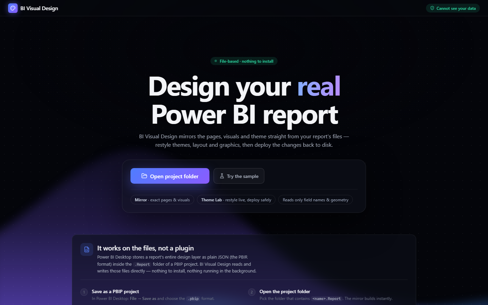

# BI Visual Design

**A design studio for Power BI reports that works directly on the files.**

Open a Power BI project folder and BI Visual Design mirrors your report — every
page, every visual, at its exact position, in its real theme. Then restyle it,
recompose it, lint it, and write the changes straight back to disk.



> 🔒 **It cannot see your data.** The design files it reads contain field
> *names*, geometry and formatting — and zero rows of data. There is nothing
> here for the tool to see, and nothing leaves your machine.

---

## The insight

Power BI Desktop keeps the entire **design layer** of a report as plain JSON on
disk — the **PBIR** (enhanced report) format, inside the `<name>.Report` folder
of a **PBIP** project:

```
MyReport.Report/
├── definition/
│   ├── report.json                    ← theme registration, resource packages
│   ├── pages/pages.json               ← page order, active page
│   └── pages/<pageId>/
│       ├── page.json                  ← canvas size, page background
│       └── visuals/<visualId>/visual.json   ← position, type, bindings, format
└── StaticResources/
    ├── SharedResources/…/Frontier.json      ← the active theme
    └── RegisteredResources/bg.png           ← images referenced by pages
```

There is no live API into Desktop's canvas — Tabular Editor and DAX Studio hit
the same wall, because Analysis Services knows about the *model*, never the
*visuals*. So instead of a bridge, this tool reads and writes those files
directly through the browser's **File System Access API**. Nothing is installed,
nothing runs in the background, and the privacy story is a consequence of the
format rather than a promise in a policy.

---

## What's in it

### 🪞 Mirror
Every page rendered at its native size with each visual at its **sub-pixel** PBIR
position, complete with title/background/border chrome and theme-resolved
colours. Click any visual to inspect its geometry and field bindings. Charts draw
representative placeholder content — the files carry bindings, not data, so the
designer works with lorem ipsum.

### 📷 True View — the report *exactly* as Desktop renders it
Placeholders are fine for composition, but sometimes you need the truth. Power BI
Desktop is already rendering your real report on the same machine, so the mirror
**borrows its pixels** via the browser's Screen Capture API — no install, no
server, frames never leave the browser.

| Mode | What you see |
|---|---|
| **Mirror** | placeholder rendering |
| **Desktop pixels** | the captured page, 1:1 |
| **Ghost overlay** | reality at full strength under a translucent editable mirror |
| **Live visuals** | every visual becomes its own slice of the capture — **and drags** |

The report canvas is **auto-detected** inside the captured window (it learns
Desktop's workspace grey from the frame's own margins), with arrow-key nudge and
`+`/`−` resize for fine-tuning. In *Live visuals*, Layout Lab moves your genuine
rendered charts — real fonts, real data, real labels.

### 📐 Layout Lab
Interactive editing on the mirror: click / shift-click to select, drag with grid
snapping and smart alignment guides, 8 resize handles, arrow-key nudge
(Shift = ×10), align (6 edges), distribute, match size, numeric X/Y/W/H, and
full undo/redo.

**Layers panel** — a Selection-pane-style stack with bring-to-front / forward /
backward / send-to-back, writing `position.z`. **Add panel** mints real rounded
shape visuals behind your content.

**Compose** — pick a layout pack and the page reflows into a designed
composition:

| Dashboards | Page layouts |
|---|---|
| **Executive Hero** — KPI band, hero chart + support column | **Detail Master** — big table + side column of cards |
| **App Shell** — left slicer rail, KPI row, hero grid | **Report List** — KPI strip, full-width table |
| **KPI Focus** — jumbo cards, charts below | **Spotlight** — one dominant visual |
| **Chart Grid** — uniform grid for dense analysis | **Comparison** — two equal columns |

Compose understands *working* reports, not just rectangles. It detects **swap
groups** (visuals stacked and toggled by bookmarks stay in one slot, so the
interaction keeps working) and **anchored companions** (small bookmark/nav
buttons travel with their host visual, keeping their proportional anchor).

### 🎨 Style Lab
Style packs set the *look* the way Layout packs set the *shape*. One click
restyles **every visual at once**, because it writes the theme's palette,
`textClasses` and `visualStyles` — the same mechanism premium templates use:
container surfaces, corner radius, shadows, titles, axis gridlines, legends,
slicer chrome, table grids and header bands, KPI callout sizing, action buttons.

Four packs ship: **Corporate Navy**, **Midnight Glass**, **Warm Minimal**,
**Mono Slate** — each previewed as a miniature dashboard drawn in its own
colours. Pack values apply as **defaults**, so a visual's own explicit
formatting still wins (exactly Power BI's precedence).

### 🌈 Theme Lab
Edit the data-colour palette and structural colours with the whole mirror
re-colouring live. Colour-harmony generator (analogous, complementary, split,
triadic, tetradic, monochromatic), preset gallery, and **A/B compare** —
original vs edited, side by side.

### 🩺 Design Doctor
A design linter for reports. It audits every page and fixes issues in one click
(or **Fix all** per category):

- **Near-misalignments** — edges within a few pixels of lining up, snapped to a
  shared edge (deduped per axis, so one nudged card doesn't report three times)
- **Inconsistent corner radii** — an outlier *within a visual type* (cards are
  compared to cards, not to charts)
- **Off-palette colours** — a colour that has **drifted** from a theme colour;
  deliberate custom colours are left alone
- **Sub-pixel positions** — fractional coordinates rounded to a whole-pixel grid

Thresholds were tuned against a real 94-visual report specifically to avoid
false positives.

---

## Architecture

### The layer model
Design work is stacked, and each layer has a different owner:

```
L3  Decorations   titles, accent bars, dividers        (z 2000+)
L2  Data visuals  your KPIs, charts, slicers, tables   (z 1000+)
L1  Panels        real rounded shape visuals            (z 100+)  ← reorderable
L0  Background    generated PNG floor (gradient/glow)   ← the ground
```

Panels are **real objects**, not pixels painted into a background image — so
they're reorderable in the Layers panel and editable in Desktop. The background
is generated *from the same slot geometry* as the layout, which means the panel
and the visual inside it are **aligned by construction** — the exact problem you
hit when you download someone else's background PNG and hand-align visuals to it.

### Module map

| Path | Responsibility |
|---|---|
| `src/pbir/` | Format core: expression trees, parser, theme resolution, File System Access, safe writes |
| `src/render/` | Mirror renderer: page canvas, visual boxes, placeholders, formatting readers |
| `src/layout/` | Geometry engine: align, distribute, match, grid snap, smart guides, resize |
| `src/designer/` | Shapes, ids, layers/z-order, classifier, Compose packer |
| `src/style/` | Style packs → full theme (palette + textClasses + visualStyles) |
| `src/doctor/` | Lint rules, raw-JSON patches, fix application |
| `src/truth/` | Desktop capture, canvas auto-detection, per-visual sprites |

Everything that computes is a **pure function** over plain data, which is why it
can all be verified in Node against real files.

---

## PBIR field notes

The format is barely documented, so these were established by reading real
reports and round-tripping writes through Desktop. They're the sharp edges:

**1 · Formatting values are expression trees.** Almost every property is wrapped,
with a type-suffixed string — and string literals carry embedded quotes:

```jsonc
{ "expr": { "Literal": { "Value": "28D" } } }        // number 28
{ "expr": { "Literal": { "Value": "'#FFBF35'" } } }  // string #FFBF35
{ "solid": { "color": { "expr": { "ThemeDataColor": { "ColorId": 1, "Percent": 0 } } } } }
```

**2 · `ThemeDataColor.ColorId` is 1-based into `dataColors`.** ColorId `1` →
`dataColors[0]`. `Percent` shades toward black (positive) or white (negative).

**3 · The active theme is *not* a stray `Theme.json`.** It's declared in
`report.json` → `themeCollection` (`customTheme` layered over `baseTheme`) and
resolved through `resourcePackages` into `StaticResources/`.

**4 · Themes use a different colour format from visuals.** Inside a theme file
there are **no expression trees** — colours are plain:

```jsonc
{ "solid": { "color": "#F9F7F2" } }
```

**5 · A shape's `fill` requires a `selector`.** Omit it and Desktop *silently*
discards your fill and paints a default:

```jsonc
"fill": [{
  "properties": { "fillColor": { "solid": { "color": { "expr": { … } } } } },
  "selector": { "id": "default" }     // ← mandatory
}]
```

**6 · Creating a visual is purely a filesystem act.** Drop a
`visuals/<20-hex-id>/visual.json` and Desktop discovers it — pages don't index
their visuals, which also makes deletion clean.

**7 · Page background images** need three coordinated edits: the file in
`StaticResources/RegisteredResources/`, an entry in `report.json`
`resourcePackages`, and a reference in `page.json`:

```jsonc
"url": { "expr": { "ResourcePackageItem": {
  "PackageName": "RegisteredResources", "PackageType": 1, "ItemName": "bg.png" } } }
```

**8 · Other shapes worth knowing:** `visualGroup` containers have no
`visual.visualType`; `isHidden: true` marks bookmark-swap partners; pages carry
their own canvas size (a Tooltip page is 320×240, not 1280×720).

---

## Verification

Design tools fail quietly — a wrong property is ignored rather than throwing. So
every engine has a harness that runs against a **real** 12-page / 94-visual
report:

```bash
npm run verify:pbir      # parser, expression trees, theme resolution, deploy payloads
npm run verify:layout    # align, distribute, match, snapping, guides, resize
npm run verify:designer  # shape encoding diffed against a DESKTOP-authored shape
npm run verify:compose   # 8 packs × 5 real pages: placement, bounds, collisions
npm run verify:style     # theme colour-format rule, structure, non-mutation
npm run verify:doctor    # lint rules + patch integrity
npm run verify:truth     # canvas auto-detection, sprite math
```

`verify:designer` is the interesting one: it diffs generated shapes
**field-for-field against a rectangle drawn by Power BI Desktop itself**, so any
drift from Desktop's real encoding fails the build.

---

## Safety

Corrupting someone's report is the one unforgivable failure. Every write:

1. **Backs up** the exact prior file to `.bi-visual-design-backup/<timestamp>/`
2. **Validates** that the content re-parses as JSON before writing
3. Touches **only** what changed — a no-op reorder writes nothing

Deploys are grouped under a single backup stamp, and edits preserve everything
they don't own (z-order, tab order, `textClasses`, `visualStyles`, custom keys).

v1 works on **PBIP** projects only and refuses to write into `.pbix` zips, where
a bad byte can corrupt security bindings.

---

## Getting started

1. In Power BI Desktop: **File → Save as** → choose the **`.pbip`** format
2. Open the app in **Chrome or Edge** (the File System Access API is
   Chromium-only)
3. Click **Open project folder** and pick the folder containing
   `<name>.Report`
4. Design — then **Deploy**, and **close and reopen the report in Desktop**

Desktop has no hot-reload for externally edited files, so the rhythm is:
**design freely → deploy once → reopen once.**

No report handy? **Try the sample** loads a synthetic one instantly.

---

## Develop

```bash
npm install
npm run dev              # Vite dev server
npm run typecheck        # strict TS, no emit
npm run build            # production build
npm run verify:pbir      # any harness; pass a path to target another PBIP folder
```

Stack: React 18 + TypeScript (strict) + Vite, with CSS custom-property design
tokens. No UI framework, no state library, no backend.

## Hosting

A static build — any host works. A [`render.yaml`](render.yaml) blueprint is
included (`npm ci && npm run build` → `dist`, SPA fallback, long-cached assets).
On [Render](https://render.com): **New + → Blueprint** → connect the repo.

## Roadmap

- **Background engine** — generated ambient floor (gradients, glow, texture) plus
  panels drawn from Compose slots, with visuals set transparent on top
- **Design packs** — layout + background + style + typography as one click
- **Typography & per-visual-type editing** inside Style Lab

---

Built by **Rishav K**. Not affiliated with or endorsed by Microsoft.
Power BI is a trademark of Microsoft Corporation.
